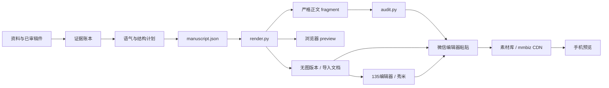

<p align="center">
  
</p>

# WeChat Article Studio

> 面向微信公众号长文的本地编辑工作流：把事实控制、中文编辑、内容型排版、图片处理、严格 HTML 审计和微信交付检查放在同一条可复现流水线上。

[](https://www.python.org/)
[](LICENSE)
[](https://github.com/LostSirius/wechat-article-studio-skill/actions/workflows/ci.yml)
[](guides/layout.md)

[GitHub](https://github.com/LostSirius/wechat-article-studio-skill) · [English](README_EN.md) · [架构](docs/ARCHITECTURE.md) · [微信兼容边界](docs/WECHAT-COMPATIBILITY.md) · [评测方法](docs/BENCHMARK.md)

## 定位

它不是“给 Markdown 换一套颜色”的模板仓库。Skill 先要求建立事实证据、识别目标账号的语气和信息结构，再选择有限的内容组件；脚本负责确定性渲染、图片标准化、GIF 合成和严格兼容审计。

适合：校园新闻、活动纪实、人物稿、访谈、品牌长文和已审稿件的格式化。它不会自动发布，也不会绕过微信编辑器的最终检查。

## 为什么不是又一个换色模板

- **事实先于文风**：先处理来源冲突、引语和不确定项，再做低 AI 痕迹编辑。
- **组件服从内容**：时间线、引语、表格、信息卡只在提升理解时出现。
- **写作与呈现分离**：UTF-8 JSON manuscript 是唯一内容输入，renderer 转成保守的内联样式 HTML。
- **风格由你决定**：8 套预设只是起点，`style` 字段可逐项覆盖配色、报头、章节、图注、引语、段落与密度；Skill 负责把你要的方向做干净，不强加一种长相。
- **真实交付边界**：浏览器里好看不等于微信里可发布；图片粘不过去时有无图版本和 HTML 导入两条备用路径。
- **可复现测试**：公开仓库只含匿名合成夹具，Windows、Ubuntu 与 macOS 运行同一套回归。

## 核心能力

1. 证据账本、事实冲突处理和账号语气指纹。
2. 中文低 AI 痕迹编辑，但不把启发式命中当作作者身份判断。
3. 8 套风格预设（学院、杂志、极简、校园、节庆、科技、水墨、暖调）加逐项 `style` 覆盖，并可用 `gallery.py` 并排比较。
4. 严格标签、属性和 CSS 白名单；预览脚本与干净正文分离。
5. 三条交付路径：含图链接复制、无图占位复制、HTML 文件导入（135编辑器代码模式 / 秀米经公众号图文导入）。
6. EXIF 校正、sRGB ICC、JPEG 4:4:4、尺寸限制与非破坏性图片导出。
7. 基于焦点坐标的 cover/contain GIF 幻灯片。
8. 375/414 px 浏览器截图（本机有 Chrome/Edge 时）和结构化构建报告。
9. 仓库卫生扫描，阻止本地路径、实验目录、临时 URL 和常见秘密进入提交。

## 工作流



## 3 分钟安装

先安装 Python 3.10+，再 clone 本仓库：

```bash
git clone https://github.com/LostSirius/wechat-article-studio-skill.git
```

本命令不依赖 GitHub Release；随后按系统执行：

### Windows PowerShell

```powershell
cd wechat-article-studio-skill
python -m venv .venv
./.venv/Scripts/python.exe -m pip install -r requirements.txt
./.venv/Scripts/python.exe scripts/self_test.py --with-slideshow
```

### macOS / Linux

```bash
cd wechat-article-studio-skill
python3 -m venv .venv
./.venv/bin/python -m pip install -r requirements.txt
./.venv/bin/python scripts/self_test.py --with-slideshow
```

路径示例统一使用 `/`；Python 与 PowerShell 都能正确处理。

## 安装为 Cursor Skill

仓库根目录保留 `SKILL.md`，复制后无需再套一层目录。

### 项目级

PowerShell：

```powershell
New-Item -ItemType Directory -Force .cursor/skills | Out-Null
Copy-Item -Recurse -Force wechat-article-studio-skill .cursor/skills/wechat-article-studio
```

跨平台：

```bash
mkdir -p .cursor/skills
cp -R wechat-article-studio-skill .cursor/skills/wechat-article-studio
```

### 个人级

PowerShell：

```powershell
New-Item -ItemType Directory -Force "$HOME/.cursor/skills" | Out-Null
Copy-Item -Recurse -Force wechat-article-studio-skill "$HOME/.cursor/skills/wechat-article-studio"
```

跨平台：

```bash
mkdir -p "$HOME/.cursor/skills"
cp -R wechat-article-studio-skill "$HOME/.cursor/skills/wechat-article-studio"
```

### Claude Code、Codex 等

六份指南是普通 Markdown，`scripts/` 提供八个标准 Python CLI，另有一个版本模块，因此可被其他支持自定义指令或脚本调用的代理使用；但不同产品的 Skill 自动发现路径、触发语义、工具权限和上下文加载方式并不相同。本项目只验证 Cursor 目录约定和本地 Python 脚本，不声称对其他代理提供原生或完全等价兼容。

## 快速开始

PowerShell：

```powershell
python scripts/build.py examples/manuscript.json --output-dir output --no-screenshots
python scripts/audit.py output/article.fragment.html --manuscript examples/manuscript.json
```

跨平台：

```bash
python3 scripts/build.py examples/manuscript.json --output-dir output --no-screenshots
python3 scripts/audit.py output/article.fragment.html --manuscript examples/manuscript.json
```

如需在复制时把本地图片路径替换为已批准的 HTTPS 地址，可增加
`--cdn-map cdn_map.json`。这只替换 URL，不会自动上传图片到微信。

拿不定风格时，先把同一份稿件渲染成 8 个预设并排比较：

```bash
python scripts/gallery.py examples/manuscript.json --output-dir gallery
```

打开 `gallery/index.html`，选中一列，把预设名写回 `theme` 即可。

输入是结构化 JSON：

```json
{
  "theme": "campus",
  "style": {"heading": "pill", "density": "airy", "palette": {"accent": "#2f8f6b"}},
  "title": "一篇虚构开放日稿件",
  "sections": [
    {
      "title": "从事实开始",
      "blocks": [{"type": "p", "text": "先核验，再编辑。"}]
    }
  ]
}
```

输出目录包含：

- `article.fragment.html`：只含文章根节点，带 `` 的正文。
- `article.noimage.html`：同一排版，每张图换成「图 N · 此处插入图片」编号占位框。
- `article.import.html`：包上最小文档外壳的正文，供支持导入 HTML 文件的编辑器使用。
- `article.preview.html`：浏览器预览，含「复制排版（含图片链接）」「复制无图版本」「下载 HTML」按钮。
- `article.render-report.json`：结构、最终生效的样式与图片交付状态。
- `audit.json`：兼容性和编辑启发式报告。
- `build-report.json`：构建路径与截图状态。
- `mobile-375.png`、`mobile-414.png`：仅在浏览器可用且未禁用截图时生成。

## 风格：预设 + 覆盖

| `theme` | 名称 | 默认组件 | 适合 |
| --- | --- | --- | --- |
| `academy` | 学院纪实 | 双线报头、编号色块章节、色条图注 | 高校新闻、游学、机构活动 |
| `editorial` | 杂志特稿 | 上下细线报头、细线章节 | 人物、访谈、品牌故事 |
| `minimal` | 极简留白 | 无框报头、最宽留白 | 图多字少、已定稿文字 |
| `campus` | 清新校园 | 下划线报头、胶囊编号、左对齐不缩进 | 社团、招新、活动回顾 |
| `festival` | 节庆典礼 | 整块色带报头、居中章节、金色点缀 | 校庆、节日、颁奖、典礼 |
| `tech` | 科技简报 | 左对齐报头、竖条章节、电光蓝 | 科研成果、产品、数据解读 |
| `ink` | 水墨人文 | 宋体、居中章节、无框引语 | 文化、历史、读书、随笔 |
| `magazine` | 暖调生活 | 焦橙点缀、竖条章节、白卡引语 | 生活方式、美食、周末、社区 |

预设只是起点。`style` 可覆盖 8 个配色令牌、字体、报头（5 种）、章节（5 种）、图注（3 种）、引语（3 种）、callout（2 种）、段落字号/行高/缩进/对齐、图片内缩和疏密度。
使用者只需描述方向（“更活泼”“更正式”“换成社团的绿色”），Skill 依据
[guides/layout.md](guides/layout.md) 的对照表把它翻译成具体参数，不会替使用者决定长相。

## 图片粘不过去怎么办

复制 HTML 只能带走图片的 URL，带不走本机文件，这是剪贴板与微信托管的限制，不是某个按钮的失误。预览页因此提供三条路径：

1. **含图链接复制**：图片已有 HTTPS 地址（微信 CDN，或已批准的图床 + `cdn_map.json`）时使用；粘贴后在微信里转存。
2. **无图版本复制**：图片只在本机时使用。先按顺序把图片上传到公众号素材库，再点「复制无图版本」，粘贴后按「图 N」占位框依次插入并删掉占位文字；图注保持在原位。
3. **HTML 导入**：点「下载 HTML」或使用 `article.import.html`。135编辑器点顶部【HTML】进入代码模式粘贴正文，或用「导入文章」；秀米没有整篇 HTML 导入入口，建议先存为公众号草稿，再用「导入公众号图文」。编辑器菜单会变，请以当前版本为准。

## 脚本命令

```text
python scripts/build.py MANUSCRIPT --output-dir output [--cdn-map MAP] [--no-screenshots]
python scripts/render.py MANUSCRIPT --output-dir output [--cdn-map MAP]
python scripts/render.py --list-presets
python scripts/gallery.py MANUSCRIPT --output-dir gallery [--presets a,b,c] [--keep-style]
python scripts/audit.py FRAGMENT --manuscript MANUSCRIPT [--json]
python scripts/prepare_images.py INPUT_DIR OUTPUT_DIR
python scripts/slideshow.py MANIFEST [--force]
python scripts/self_test.py --with-slideshow
python scripts/hygiene.py . --json
```

图片导出会保留 sRGB ICC，并以 `subsampling=0` 输出 JPEG 4:4:4；自测会直接断言这两个行为。

## 微信的真实限制

- 微信编辑器可能过滤标签、属性和 CSS；本项目采用的严格配置是保守基线，不是官方规范。
- **复制按钮复制的是 HTML 排版和图片 URL，不会复制本地 JPG、PNG、GIF 文件。**
- `file://`、相对路径、`blob:` 或 `data:` 图片即使在桌面预览可见，也不能据此认为可以粘贴到微信；预览页会在发现此类未解析图片时禁用含图复制，并保留无图复制与 HTML 下载。
- 普通 HTTPS 图片可能暂时粘贴成功，但仍需在微信编辑器内转存/重传。
- 发布前仍需：选择匹配图片状态的交付路径 → 粘贴或导入 → 插入/转存图片 → 确认最终图片来自 `mmbiz.qpic.cn` 或官方素材库 → 手机预览。
- GIF 仍受文件体积、256 色和编辑器上传限制。
- 静态兼容分 100 只表示当前审计规则全部通过，**不等于微信官方认证**。

## 实验数据与边界

公开回归包含 4 个匿名合成稿件，覆盖 4 套预设加样式覆盖、事实卡、日期、段落、引语、callout 和四列以内表格；风格矩阵测试把 8 个预设、全部 18 个组件变体和一组综合覆盖各渲染一次，并对含图与无图两个版本都执行严格审计；另含非法样式拒绝、gallery 生成、非法 HTML 拒绝、ICC/4:4:4 图片导出、双帧 GIF 和仓库卫生测试。

2026-09-10 在 Python 3.12 环境中的公开基线：4/4 fixture 均为 `strict_compatibility=100`、`editorial_heuristic=100`、0 fatal、0 warning；27 个风格用例 0 fatal；非法 HTML 与非法样式被拒绝；1200×600 测试 JPEG 含 sRGB ICC 且为 4:4:4；540×720 双帧 GIF 通过；卫生扫描 0 命中。

这些是静态和工程回归，不是审美排行榜。项目目前不能声称 SOTA；详见 [docs/BENCHMARK.md](docs/BENCHMARK.md)。

## 目录

```text
.
├── SKILL.md
├── guides/                     # 编辑、排版、图片、质量与研究方法
├── scripts/                    # 8 个 CLI + 1 个版本模块
├── evals/                      # 4 个匿名合成夹具
├── examples/manuscript.json
├── assets/                     # 1600×450 横幅与 512×512 图标
├── docs/                       # 架构、兼容性、评测与法律说明
└── .github/                    # CI、贡献、安全、Issue 与 PR 模板
```

## 路线图

- 增加经过许可的匿名微信编辑器粘贴回归记录。
- 扩展暗色模式与更多移动端字体测试。
- 发布可复用但不绑定品牌的 manuscript schema。
- 建立盲评协议，在有真实比较数据前不做 SOTA 声称。

## 贡献

请先阅读 [.github/CONTRIBUTING.md](.github/CONTRIBUTING.md) 和
[.github/SECURITY.md](.github/SECURITY.md)。公开 issue、PR 和 fixture 不得包含真实姓名、未授权文章、照片、二维码、账号后台信息、本地绝对路径或访问令牌。

当前维护者与代码所有者：[LostSirius](https://github.com/LostSirius)。

## 来源与致谢

本项目独立实现。思想层面的公开参考包括
[gzh-design-skill](https://github.com/isjiamu/gzh-design-skill)、
[wechat-styler](https://github.com/zjp1997720/wechat-styler)、
[wechat-article-skills](https://github.com/dengqikuang/wechat-article-skills)、
[xiaohu-wechat-format](https://github.com/xiaohuailabs/xiaohu-wechat-format)、
[md2wechat-skill](https://github.com/geekjourneyx/md2wechat-skill)、
[min-skill](https://github.com/limin112/min-skill)、
[lieflat-less-ai-tone](https://github.com/larashero3-dotcom/lieflat-less-ai-tone) 和
[de-aigc-ch](https://github.com/hongcha1101/de-aigc-ch)。
许可证边界见 [NOTICE.md](NOTICE.md)，运行时依赖见
[docs/legal/THIRD_PARTY_NOTICES.md](docs/legal/THIRD_PARTY_NOTICES.md)，品牌图授权见
[docs/legal/ASSETS-LICENSE.md](docs/legal/ASSETS-LICENSE.md)。

## 许可证与非官方声明

独立实现部分以 [MIT License](LICENSE) 发布。本项目与腾讯、微信及上述参考项目均无隶属或背书关系；品牌视觉不含微信官方 Logo，也不暗示官方认可。
